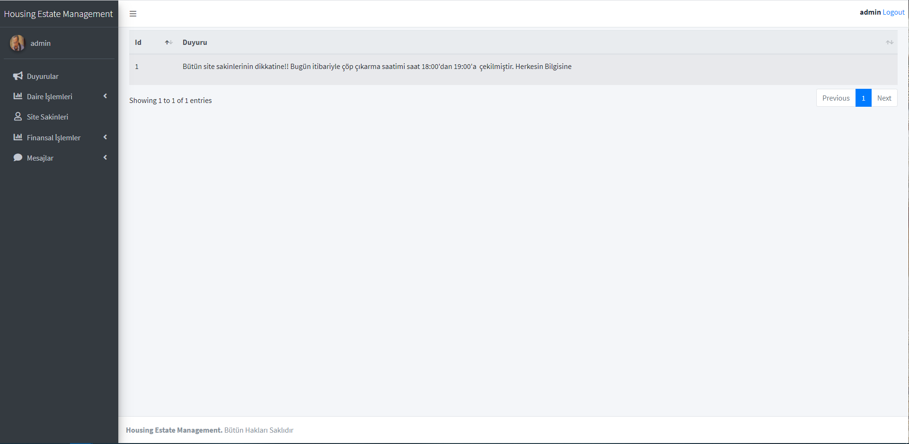
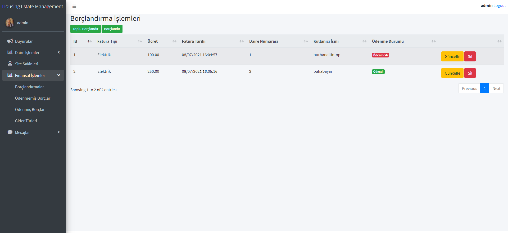
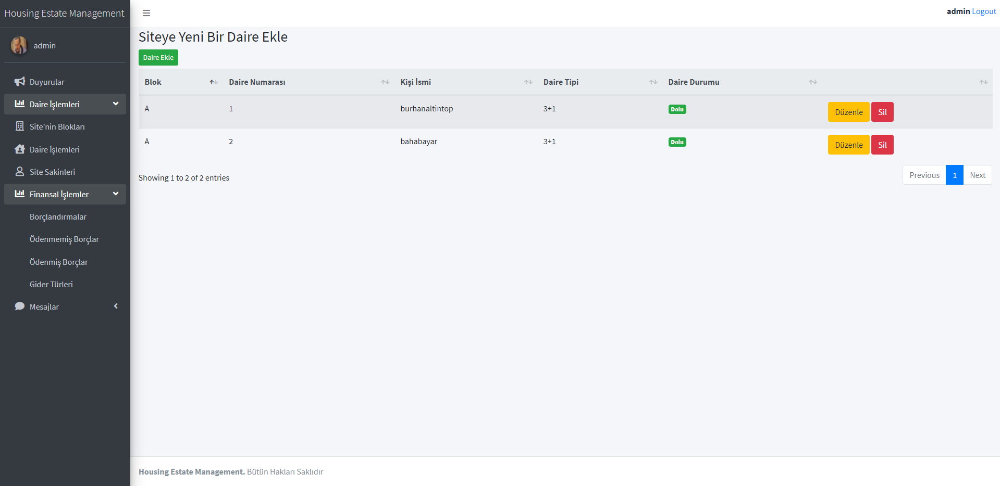
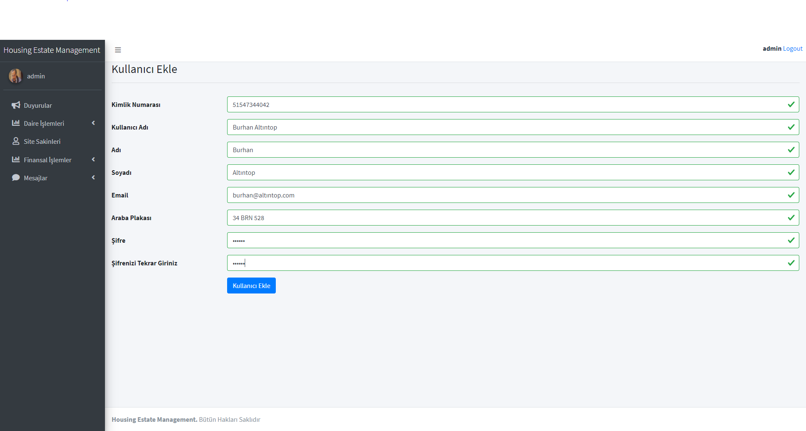
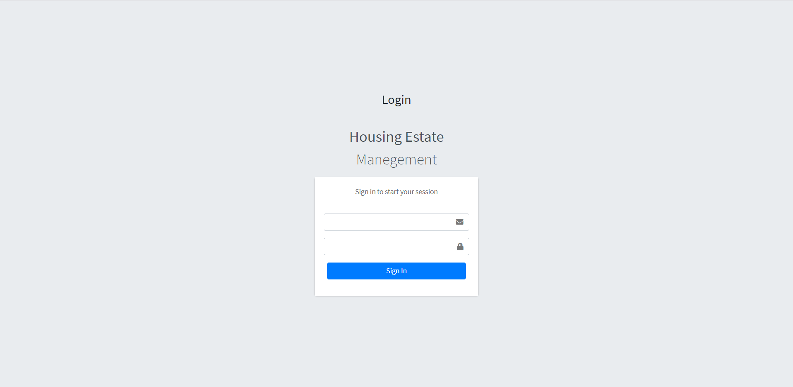

Kodluyoruz ve Apsiyon iş birliği ile yapılan **Apsiyon .Net Core Bootcamp**'nin bitirme projesi olarak **Housing Estate Management** adlı uygulamayı geliştirdim.  Projenin içerisinde İki farklı kullanıcı tipi bulunmakta ve bu kullanıcı tipine göre belli özellikler barındırmakta. 

### 1-Admin/Yönetici Rolü 

* :ear: ​**Duyuru İşlemleri : ** Yönetici **Housing Estate Management** aracılığı ile duyuru ekleyebilir, silebilir, düzenleyebilir.
* :house: **Site ile İlgili İşlemler :** Yönetici  **Housing Estate Management** aracılığı ile siteye blok ekleyebilir, silebilir, düzenleyebilir aynı zamanda siteye daire ekleyebilir, silebilir, düzenleyebilir.
* :man: **Kullanıcı İşlemleri :** Yönetici  **Housing Estate Management** aracılığı ile kullanıcı ekleyebilir, silebilir, düzenleyebilir.
* :dollar:  **Finansal İşlemler** : Yönetici  **Housing Estate Management** aracılığı ile bütün borçları görüntüleyebilir, ekleyebilir, silebilir, düzenleyebilir, bütün ödenmiş borçları görüntüleyebilir, gider türü ekleyebilir, silebilir, düzenleyebilir, toplu olarak veya tek bir daire’yi borçlandırabilir. 
* :package:  **Mesaj işlemleri :** Yönetici  **Housing Estate Management**  gelen kutusu ’nu görüntüleyebilir, giden kutusu ‘nu görüntüleyebilir, sitede ki istediği kişiye mesaj gönderebilir. 

### 2- Kullanıcı Rolü

* :ear:: **Duyuru İşlemleri :** Kullanıcı **Housing Estate Management** aracılığı ile duyuruları görüntüleyebilir.

* :dollar: **Finansal İşlemler :** Kullanıcı **Housing Estate Management** aracılığı ile kendisine ait ödenmemiş borçları görüntüleyebilir, ödeyebilir, ödediği borçları görüntüleyebilir.

* :package:**Mesaj İşlemleri :** Kullanıcı **Housing Estate Management** aracılığı ile  gelen Kutusu ’nu görüntüleyebilir, giden kutusunu görüntüleyebilir ve yöneticiye mesaj gönderebilir.

  

  ## :computer: Projenin Kurulumu

   Proje’yi çalıştırmak için MongoDb ve Microsoft Sql Server’ın bilgisayarınızda yüklü olması gerekmektedir. Bu kurulumları tamamladıktan sonra veritabanlarımızın yerel sunucumuzda oluşmasını sağlamak için projemizi açıyoruz. Başlangıç projemizi **HousingEstateManagement.Web** olarak belirledikten sonra package manager console’umuzda varsayılan projemizi **HousingEstateManagement.Data** olarak belirliyor ve **update-database** komutunu giriyoruz.Bu işlemden sonra veritabanımız yerel sunucumuz içerisinde oluşuyor. Son olarak projeyi çalıştırmak için solution ayarlarından **Multiple Startup Project**  olarak **HousingEstateManagement.Payment.API** ve **HousingEstateManagement.Web** projelerini seçiyoruz. Uygulamayı çalıştırırken **HousingEstateManagement.Service** içindeki **PaymentAPIService** üzerinden yerel sunucunuzu kendi kullandığınız api için  portları ile değiştirmeniz gerekmektedir 

  #### Admin olarak giriş yapmak için gerekli olan bilgiler: 

  **Email:**admin@admin.com

  **Şifre**:admin123

<h2> 🛠 &nbsp;Kullanılan Teknolojiler</h2>

<table style"float:right;">
  <tr>
    <td></td>
    <td></td>
    <td></td>
  </tr>
  <tr>
    <td></td>
    <td>
    <td></td>
  </tr>
  <tr>
    <td></td>
    <td> </td>
    <td></td>
  </tr>
  <tr>
    <td></td>
 		<td></td>
    <td></td>
  </tr>
</table>

## :phone: İletişim

 

   
<b> <samp> İletişime Geçin </samp></b>

    
   <samp>
   <b><h2 style="color: #fc6203">MAHMUT &nbsp; BAHA &nbsp; BAYAR</h2></b>
   
      
     Projenin Linki: <a href="https://github.com/bahabayar/HousingEstateManagement">Housing Estate Management</a>
      
     Instagram: <a href="https://www.instagram.com/bahabayar/"> Instagram Hesabım</a>
      
     Facebook: <a href="https://www.facebook.com/bahabayar/"> Facebook Hesabım</a>
      
     Mail Adresim: <a href="#"> bahabayar@hotmail.com</a>
   </samp>
 

